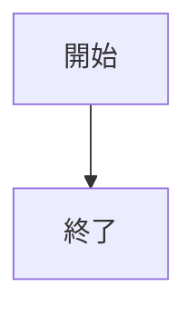
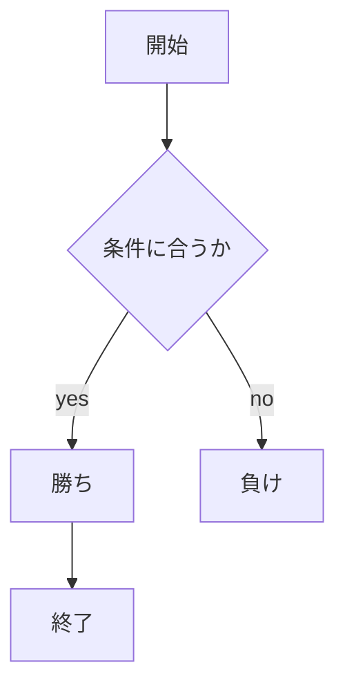

# webpro_06
2024 10/29


2024 11/05


```javascript
console.log( 'Hello' );
```

```javascript
console.log('aaaaa');
```




# webpro_06
ファイル名 | 説明 
-|-
app5.js | プログラム本体 
public/janken.html | じゃんけんの開始画面 
janken.ejs | じゃんけん開始の画面で表示される文字
## このプログラムについて
## ファイル一覧
