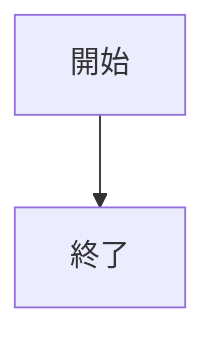
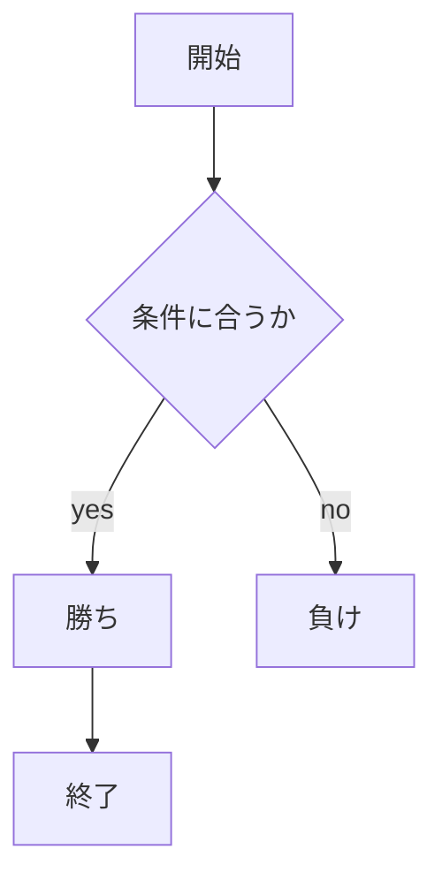
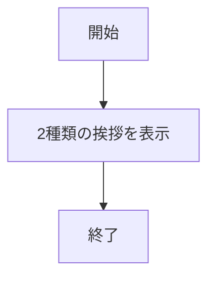
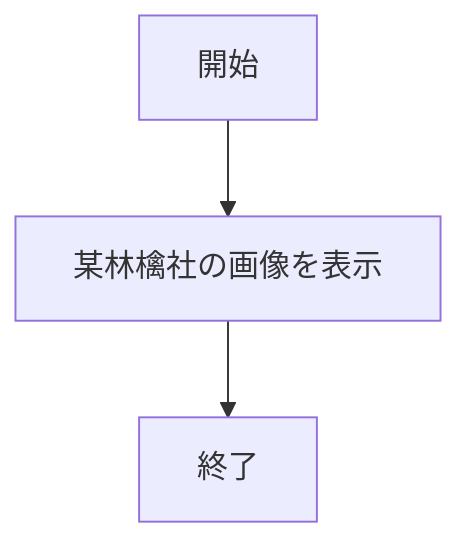
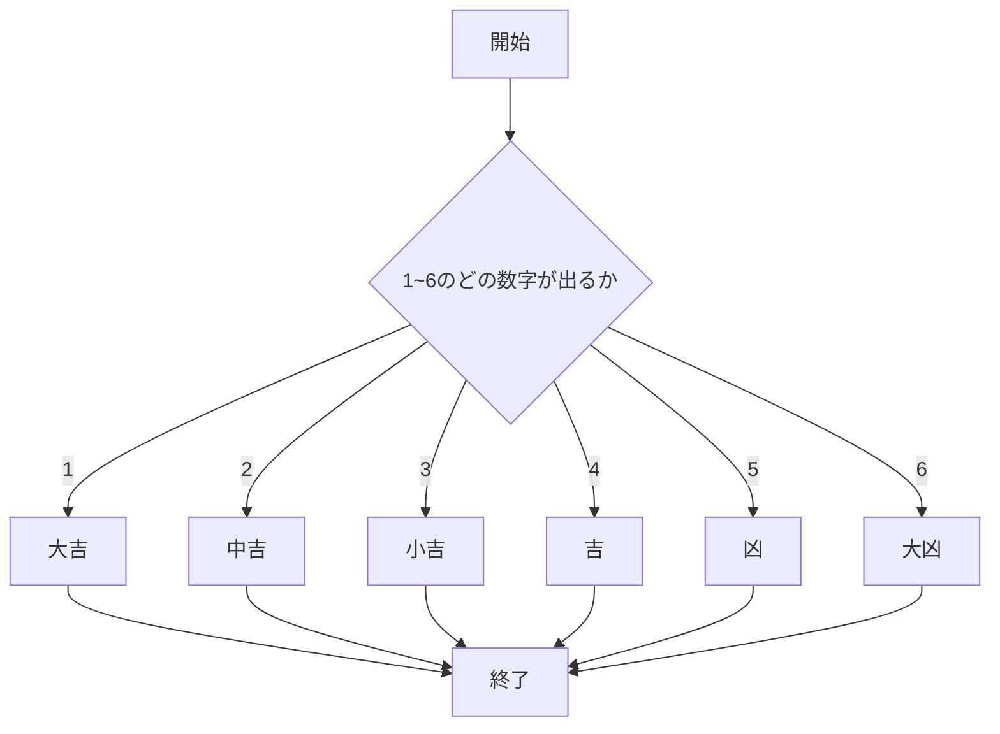
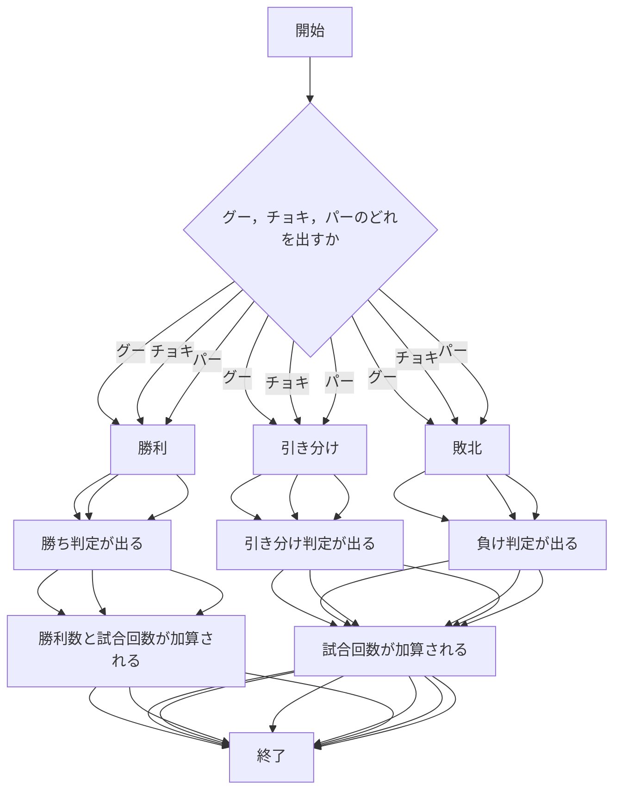
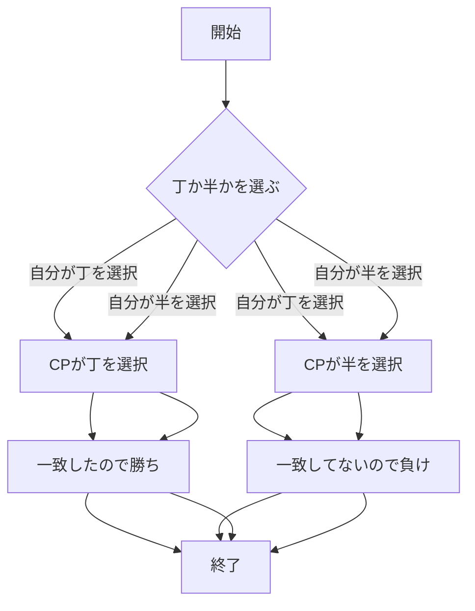
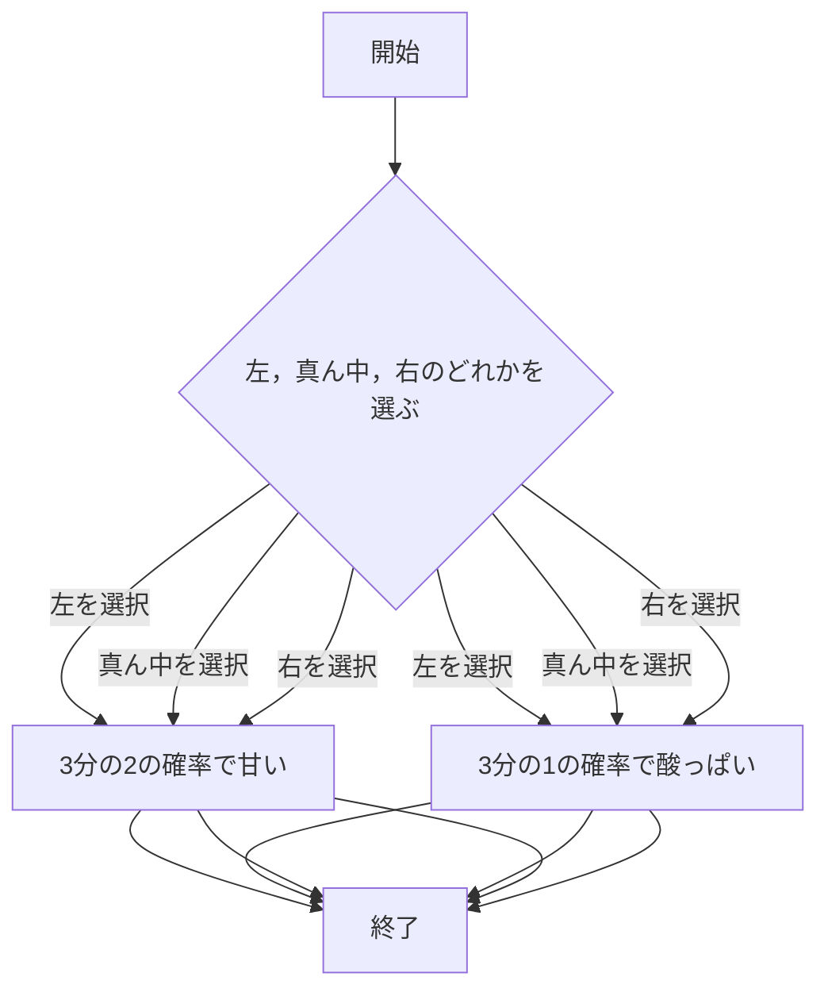

# webpro_06
2024 10/29


# webpro_06
2024 11/05

```javascript
console.log( 'Hello' );
```

```javascript
console.log('aaaaa');
```





ファイル名 | 説明 
-|-
app5.js | プログラム本体 
public/janken.html | じゃんけんの開始画面 
janken.ejs | じゃんけん開始の画面で表示される文字
## このプログラムについて
## ファイル一覧

## app5.js 全体のドキュメント（レポート課題）
以下，app5.jsの全文  
```javascript
const express = require("express");  
const app = express();  

app.set('view engine', 'ejs');  
app.use("/public", express.static(__dirname + "/public"));  

app.get("/hello1", (req, res) => {  
  const message1 = "Hello world";  
  const message2 = "Bon jour";  
  res.render('show', { greet1:message1, greet2:message2});  
});  

app.get("/hello2", (req, res) => {  
  res.render('show', { greet1:"Hello world", greet2:"Bon jour"});  
});  

app.get("/icon", (req, res) => {  
  res.render('icon', { filename:"./public/Apple_logo_black.svg", alt:"Apple Logo"});  
});  

app.get("/luck", (req, res) => {  
  const num = Math.floor( Math.random() * 6 + 1 );    
  let luck = '';  
  if( num==1 ) luck = '大吉';    
  else if( num==2 ) luck = '中吉';  
  console.log( 'あなたの運勢は' + luck + 'です' );  
  res.render( 'luck', {number:num, luck:luck} );  
});  


app.get("/janken", (req, res) => {  
  let hand = req.query.hand;  
  let win = Number(req.query.win) || 0;     
  let total = Number(req.query.total) || 0;   

  console.log({ hand, win, total });  

  const num = Math.floor(Math.random() * 3 + 1);  
  let cpu = '';  
  if (num === 1) cpu = 'グー';  
  else if (num === 2) cpu = 'チョキ';  
  else cpu = 'パー';  

  let judgement = '';  
  if (hand === cpu) { // ユーザーの手とCPUの手が同じ場合は「引き分け」。  
    judgement = '引き分け';  
  } else if ( // ユーザーが勝つ組み合わせの場合は「勝ち」とし、winを1増加する。  
    (hand === 'グー' && cpu === 'チョキ') ||  
    (hand === 'チョキ' && cpu === 'パー') ||  
    (hand === 'パー' && cpu === 'グー')  
  ) {  
    judgement = '勝ち';  
    win += 1;   
  } else { // それ以外は「負け」  
    judgement = '負け';  
  }  

  total += 1; //  ゲームが終了したので、総試行数totalを1増加させる。  

  const display = {  
    your: hand,  
    cpu: cpu,  
    judgement: judgement,  
    win: win,  
    total: total  
  };  
  res.render('janken', display);  
});  

app.get("/chohan", (req, res) => {  
  const choices = ["丁", "半"];  
  
  // ランダムにサーバーの選択を決定  
  const serverChoice = choices[Math.floor(Math.random() * 2)];  
  
  // クエリパラメータからユーザーの選択を取得  
  const userChoice = req.query.choice;  
  
  // 勝敗判定  
  let outcome = '';  
  if (userChoice === serverChoice) {  
    outcome = '勝ち';  
  } else {  
    outcome = '負け';  
  }  

  // `chohan.ejs`にデータを渡してレンダリング  
  res.render('chohan', {  
    userChoice: userChoice,  
    serverChoice: serverChoice,  
    outcome: outcome  
  });  
});  

app.get("/taste", (req, res) => {  
  // ユーザーの選択を取得（クエリパラメータから）  
  const choice = req.query.choice;  

  // 3分の1の確率で「酸っぱい」、3分の2の確率で「甘い」  
  const randomValue = Math.random();  
  const taste = randomValue < 1 / 3 ? "酸っぱい" : "甘い";  

  // 結果をテンプレートに渡す  
  res.render("taste", { choice: choice, taste: taste });  
});

app.listen(8080, () => console.log("Example app listening on port 8080!"));  
```
  
以下の表はapp5.jsの内部の各プログラム及び関連ファイルの名前と説明をまとめたものである．
ファイル，機能名      | 説明 
-|-
app5.js            | プログラム本体 
hello1             | 2種類の挨拶を表示するプログラム
hello2             | 2種類の挨拶を表示するプログラム
show.ejs           | hello1とhello2の，表示されるときのタイトルや形式を設定する
icon               | 埋め込まれたURLから画像を表示するプログラム  
icon.ejs           | iconの，画像が表示されるときのタイトル等を設定する
luck               | 大吉や大凶などが出るおみくじで遊べるプログラム
luck.ejs           | 大吉や大凶などを表示する形式を設定する
janken             | 自分とコンピューターでじゃんけんができるプログラム
janken.ejs         | 自分とコンピューターの出す手や自分の勝利回数の表示形式を設定する
chohan             | コンピューターと丁半で遊べるプログラム
chohan.ejs         | 自分とコンピューターの選択や勝ち負けの結果の表示形式を設定する
taste              | 3個中1個だけ酸っぱいあのお菓子を擬似的に楽しめるプログラム
taste.ejs          | タイトルや酸っぱいかどうかの結果の表示形式を設定する

上記のapp5.jsについて説明する．
app5.jsは7つの機能を持ち，それぞれ hello1，hello2，icon，luck，janken，chohan，taste となっている．
これらの機能を起動する方法はそれぞれ異なるが，一部共通している箇所があるので最初にそれを説明する．  
まずターミナルを開き，app5.jsが入っているディレクトリに移動する．
移動後"node app5.js"と入力し，  
Example app listening on port 8080!  
という表示を確認する．  
次に別のターミナルを開き，"telnet localhost 8080"と入力し，  
Trying ::1...  
Connected to localhost.  
Escape character is '^]'.  
という表示を確認する．  
ここまでが7つの機能全てに共通する箇所である．以下，各機能ごとに起動方法やプログラムのフローチャートを記載する．

・hello1  
前述の起動手順を終えた後，最後に表示を確認した方のターミナルに   
GET /hello1 HTTP/1.1  
Host: localhost  
と入力し，改行してからエンターキーを押す．
これでプログラムそのものは起動するので，ブラウザで  
http://localhost:8080/hello1  
と入力すれば出力結果を見ることができる．  
以下，hello1のフローチャートである．


・hello2  
前述の起動手順を終えた後，最後に表示を確認した方のターミナルに   
GET /hello2 HTTP/1.1  
Host: localhost  
と入力し，改行してからエンターキーを押す．
これでプログラムそのものは起動するので，ブラウザで  
http://localhost:8080/hello2  
と入力すれば出力結果を見ることができる．  
以下，hello2のフローチャートである．


・icon  
前述の起動手順を終えた後，最後に表示を確認した方のターミナルに   
GET /icon HTTP/1.1  
Host: localhost  
と入力し，改行してからエンターキーを押す．
これでプログラムそのものは起動するので，ブラウザで  
http://localhost:8080/icon  
と入力すれば出力結果を見ることができる．  
以下，iconのフローチャートである．


・luck  
前述の起動手順を終えた後，最後に表示を確認した方のターミナルに   
GET /luck HTTP/1.1  
Host: localhost  
と入力し，改行してからエンターキーを押す．
これでプログラムそのものは起動するので，ブラウザで  
http://localhost:8080/luck  
と入力すれば出力結果を見ることができる．  
以下，luckのフローチャートである．


・janken  
前述の起動手順を終えた後，最後に表示を確認した方のターミナルに   
GET /janken HTTP/1.1  
Host: localhost  
と入力し，改行してからエンターキーを押す．
これでプログラムそのものは起動するので，ブラウザで  
http://localhost:8080/janken  
と入力すれば出力結果を見ることができる．  
以下，jankenのフローチャートである．


・chohan  
前述の起動手順を終えた後，最後に表示を確認した方のターミナルに   
GET /chohan HTTP/1.1  
Host: localhost  
と入力し，改行してからエンターキーを押す．
これでプログラムそのものは起動するので，ブラウザで  
http://localhost:8080/chohan  
と入力すれば出力結果を見ることができる．  
以下，chohanのフローチャートである．


・taste  
前述の起動手順を終えた後，最後に表示を確認した方のターミナルに   
GET /taste HTTP/1.1  
Host: localhost  
と入力し，改行してからエンターキーを押す．
これでプログラムそのものは起動するので，ブラウザで  
http://localhost:8080/taste  
と入力すれば出力結果を見ることができる．
以下，tasteのフローチャートである．
